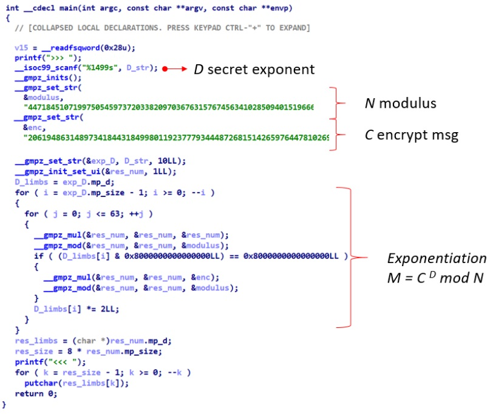
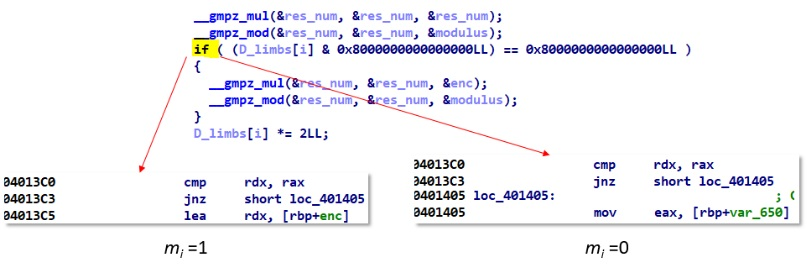

# Tracing-into-the-night
</br>
В наличии исполняемый файл **tracing-into-the-night** и 10-ти мегабайный текстовой файл **trace** с полной трассировкой хода исполнения программы. Псевдокод функции main исполняемого файла следующий:</br>
</br>
Первое. Используется популярная библиотека для работы с большими числами GMP. Второе, это процедура расшифрования криптосистемы RSA (https://en.wikipedia.org/wiki/RSA_(cryptosystem)). Нам известен модуль N и зашифрованное сообщение C. Необходимую экспоненту D должен ввести пользователь. Конечно, у нас нет того самого пользователя, знающего D. Но есть **trace**.</br> 
Фишка в том, что алгоритм возведения в степень не сложный (https://ru.wikipedia.org/wiki/Алгоритмы_быстрого_возведения_в_степень). Здесь используется алгоритм быстрого возведения в степень по модулю (биты показателя степени «просматриваем» от старших к младшим). Последовательность действий такая:</br>
- Представить показатель степени D в двоичном виде – последовательность бит mi
- Положить вспомогательную переменную res_num (на рисунке) равной 1
  - Число res_num возводится в квадрат по модулю N
  - Если mi =1, то число C умножается на res_num по модулю N, а при mi = 0 ничего не делаем
  
Тут то нам trace и поможет. Надо отловить момент проверки mi = 1 и восстановить бинарную последовательность показателя степени D.</br>
</br>
Последовательность адресов 4013C0, 4013C3, 4013C5 в файле trace даст нам 1 в степень D, а последовательность 4013C0, 4013C3, 401405 даст 0. </br>
```python
data = open("trace", "r").readlines()
res = ""
for i in range(len(data)-3):
  if data[i][:6] == "4013c0" and data[i+1][:6] == "4013c3" and data[i+2][:6] == "401405":
    res += "0"
  if data[i][:6] == "4013c0" and data[i+1][:6] == "4013c3" and data[i+2][:6] == "4013c5":
    res += "1"
res = "0b" + res
D = int(res, 2)
print(D)
```
# Число D
244652648608644057289603953074612700175933964244789320848667909167563692702652547784242339814218808951063055612658793570186844889979282952606878226608877859935559988556621623278752812292605612612163883997532869509885618332866441068962865470136130272926263303521750180711550883814600026677234330838029265221441047841355637850083056067511836089295432603059046109298537904428654107114553910703320935211803599935665225999452564664140186232164739291375407556107412707105250411308366447742913058979723684840765449422267902293487537073300912104264330520400754843332881465525532116517816288168335852096828051764240859454454009518120111671812902113201938369763608841769720763131720010223805776325980208111929662026610968279056747490265115993253416851071451892127738460444147514901971784385322720069737101076139227245987315223123169336706863690888801293487213146614146679028050257150777887496982927824949105219206894794372697828812226397922441686397417061966543488748591869285400239357533529688996471390996874988047597260063994210684092801510867133594884893681119353051040329814500624965262408435785310992711659906711739870502390260550767314380870394028475183756688989994399612240550769839124489086507436798682013488698499282429664122768579273</br>
# Теперь находим флаг
```python
N = 447184510719975054597372033820970367631576745634102850940151966618731605875156603657394790807543106462859279756988407591949107615522863390461497094889583832285505368011025277501593168573992303270489038224691442450686759689891729140611332152177145996284158921291450051409647476573907180263447394788228251424280628988395605571911678859197411847278057914005876582487750066728230489972570621831363662835754358638507653502332247396283792639726133564046021057163896432451730475691435277805809319379560762331871294346316316067725358169653378233919158536201485710988901202235303258129357860206058478283916330455251797686976821594656048049233954144004025483722105654884172390572538592913614550964028742160902939065458363445878211400922484689130587557536611227474183785476967312517433701519124394658554196927688328078861716111995393055553258106323572560000151109800863858606556115035564977152159549221498729357527824280812698220743179468722094175413271548368111459152019209395355285403167321317054983346720908955526763883023592954877344827198138450778799845867272004037182415000344356599436566583214792707692827962021886034463860264454270037624332927135751105024028534723013339718674741591919194067341852869368415679054292752733683732089731387
C = 206194863148973418443184998011923777934448726815142659764478102694220996572119235751853954476217084193430829093504204472298488452624209362687339175896596362582228104929807498230107999896189519983693174316302603882565654551447545866901593208120708529551321959949630329565423658895459815612132400107388877020500657132548424936286415877973588244076409661681185349469887803521244472504863916028771153747492559175905221071303832573541610667743817838547332360516015787210092129304221221183618372967739299298777363556251058520242891401281256649786020186398625605225547913819629763030927116797845975035799543683839219783896048175102837544478413783104917473648240255777477126155618892207667435904754185970341242419873645432568764803631809516735547122871847958859542385261341824769779570200757102079677971221387617945420283890428815682081937792280748511609366578883928161730697714370794175564255279315209053633551762271786422409837742423771079598091135349027890359740015253411564713414564272128678631947183569729406893947313967249940381200018159756340255865703017655373279844036589580873692635425966356950980800794902191109605672172486268061978229431121034086918172833706720523324225354562780368660709612457907279718303360035550622133576978589
M = pow(C, D, N)
res = ""
while M > 0:
  res += chr(M & 0xFF)
  M >>= 8
print(res[::-1])
```
# Флаг
dam{and_1nto_d4ta_depend3ncy}
