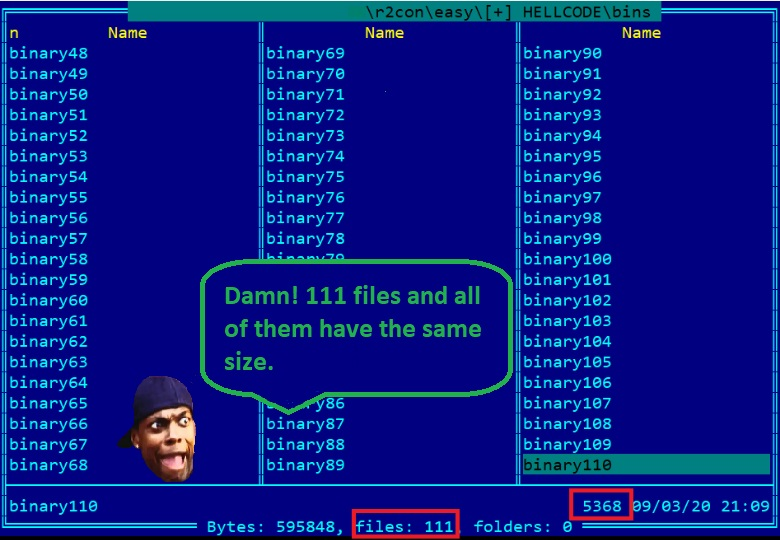
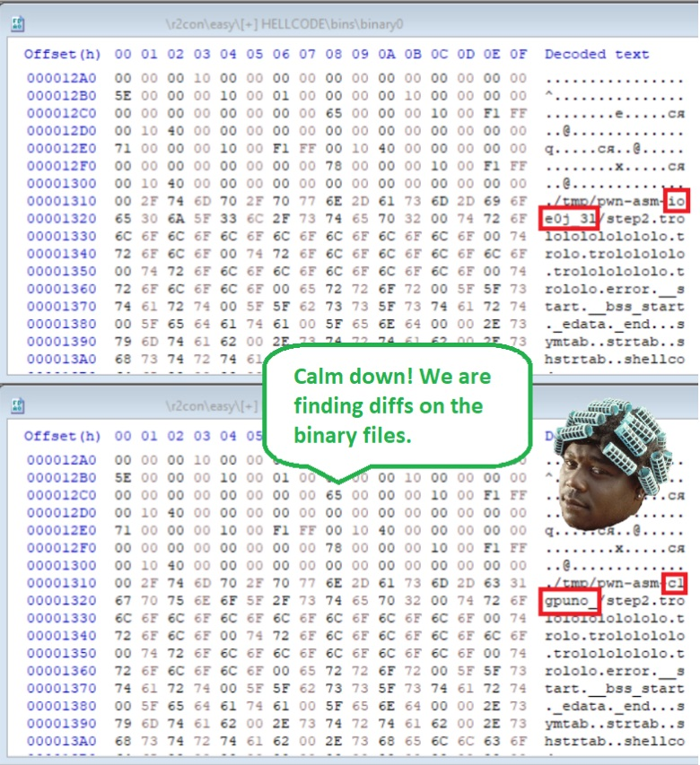
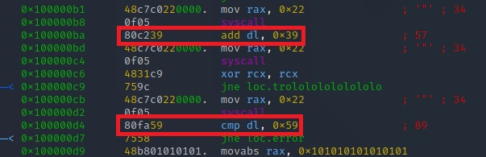

# Goal
To find the flag from the ELF files.
# Tools
radare2, hxd, far, python
# Challenge description
We have been told that an insider is exfiltrating some secrets from Evil Corp. He is exfiltrating different chunks of information in all the software is developing. Are you able to find the exfiltrated secrets?
# Solution
# What do we have?

# Let's compare the first two files

 
We found several differences in the file. 
The first difference is in the code section for the folowing offsets 0x10BC and 0x10D6. 
The second difference looks like a small diversion because the data dosen't look like somthing intelligible. 
# What do we do?

# Time to RE
Command line: r2 binary0 and then we use command vv
 
We found an interesting piece of code because the dl register is 8 bits in size, which is a character. Also note that an sub operation is used at the beginning and then a comparison with the hardcoded value is performed. 
Then we can assume that we have an encrypted message with a length of 111 characters. Let's check it out. 
We use the foolowing python script: 
 
But something went wrong. We got our runtime error.
 
From the error, we see that we could not find the sub operation in binary4 but we received part of the message "Rose". Let's see what has changed in binary4: 
 
The xor operation is used instead of the sub operation. Add the xor operation to the script and check it again:
 
The situation looks sad, we were able to decipher only one character. Let's repeat the actions described above with binary5.
 
Ooooh, we got add operation, let's add it too and check it again:

