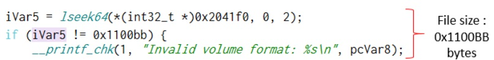
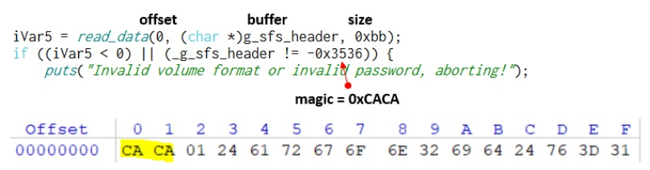
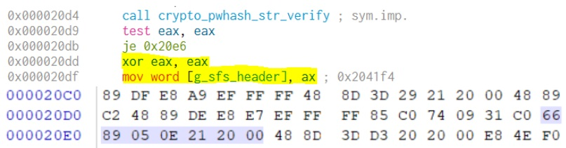

# Инструменты
Cutter, WinHex 

# Дано
Исполняемый файл shit-fs и двоичный файл flag.sfs 
Смотрим на файла shit-fs: 
 
Распаковываем с помощью UPX. 
В начале программы есть “usage”: 
 
Значит, наш flag.sfs – образ некоего диска, неизвестного формата. Но! Нам неизвестен пароль (переменная pwd), который вводит пользователь при монтировании диска. Функция crypto_pwhash_str библиотеки libsodium получает на вход пользовательский пароль для создания хэша. Это еще не проверка пароля. 
 
Тогда изучаем код, связанный с sfs-файлом. Размер файла flag.sfs должен быть строго 0x1100BB: 
 
Читаем заголовок файла длиной 0xBB байт в буфер _g_sfs_header. Одна простая проверка. Первые два байта строго равны 0xCACA. 
 
Монтируем sfs-файл через fuse драйвер (функция fuse_main_real). 
 
В переменной list_fuse_ops находится список переопределенных файловых операций (структура fuse_operations). Возможно в одной из них есть та самая проверка пароля.
Изучаем список файловых операций в структуре fuse_operations: https://code.woboq.org/linux/include/fuse/fuse.h.html#fuse_operations. 
Предполагаем, что операции с паролем происходят в функции инициализации init: 
 
Так и есть. Внутри f_init() находим проверку пароля с помощью функции crypto_pwhash_str_verify. Кстати, во всем исполняемом файле эта функция вызывается всего лишь один раз. 
 
Результат проверки – в наш буфер _g_sfs_header в первые два байта вносим 0, если пароль неправильный. Таким образом, затираются magic байты 0xCACA в буфере _g_sfs_header. Ну, тут два пути решения: брутить пароль (он тоже находится в заголовке sfs-файла) или пропатчить исполняемый файл (чтобы _g_sfs_header оставался в целости и сохранности).  
Я выбрал второй вариант. Место, где надо патчить: 
 
Патчим NOPами. 
Теперь запускаем файл с любым паролем и читаем флаг. 
 
 
Что хочет Джон. Наверно, ту самую 0xCACA.
